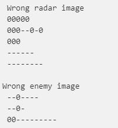

# Find The Invaders!

Our radars are affected by enemy disruptors, so the images they produce are quite noisy. Fortunately, we do have information about the invaders’ undisrupted radar images!


## Configuring your environment

To run this project it is necessary to have a computer, preferably with Linux,
with the Ruby programming language version 2.6.3

First install **Ruby 2.6.3** (you can use RVM or asdf):

* [RVM](https://rvm.io/)
* [asdf](https://github.com/asdf-vm/asdf)
---
## Used Gems
For tests writing:
* gem 'rspec'
* gem 'rspec-expectations'

For debugging:
* gem 'pry'
---
## Setup

Inside the project directory, you must install the dependencies defined in the 
*Gemfile* file with the following command in your **terminal**:

```bash
bundle install
```
---
## Required resources to check the radar

To start the radar scan to check if there are any enemies in our area, you will need:
* .txt file path with the ASCII image of the **enemy**
* .txt file path with the ASCII image of the **radar**

To make it easier, there are already enemy and radar images in the project to use, but 
if you want to generate your own enemy/radar image, you will need to add the file in 
the directory:
```bash
resources/enemy
```
or 
```bash
resources/radar
```

#### Exemple
Here are some enemy and radar examples:

**Exemple 1: Enemy**
```bash
--OO--
-OOOO-
OO--OO
-OOOO-
```

**Exemple 2: Radar**
```bash
O------OO---------O----------O-------------------
------OO-O---------OO---------O-------OO------0--
------O--OO----------------O-O-------OO-O--------
--O---O-OO-----------O----O-O-O---------OO--0----
-----------------OO-------O--OO-------OOO--------
------O-------------------OOOOO------------------
--O------------OO--OO-----OO-O---------------O-O-
----------------OOOO------------------------O-O-O
---O-O----------------------O---------0-----OOOOO
--O-O-O-----O----------------------0--------OOOOO
--O--OO---------------OO--------------------OO-OO
--OOOOO-------O------O--O-----O---000-0----------
--OO----------------OO--O-------------------0----
---------------------O--O------------0-----------
------0----OO------------------------O-OO------O0
----------O---------------OO--------OO--OO----O0O
---O-----OO--OO----O-=---------------OOOO-----O-O
--OO------OOOO----O-O-O---------0-------------OOO
-OOOO-------------O---O----------------O-O----OO-
OO--OO---O--------O---O------O--------O-O-O----0-
-OOOO-------------OO-OO-----O-O-----0-OOOOO------
-----O----------------------O-O-------OOOOO---0--
--O-O-O---O--------OO-------OOO-------OO-OO------
--OO--O---------O-----------OO----------------0--
```
---
## Checking the radar
Having the enemy and radar ASCII file paths, let's start our validation:

Enter the Ruby console:
```bash
irb -rapp.rb
```

In the project console, import the Radar class:

```bash
require_relative 'radar.rb'
```

After that instantiate the class and send the necessary parameters:

```bash
radar = Radar.new("resources/enemy/enemy1.txt", "resources/radar/radar.txt")
```

Finally, run the check_radar method to find out if there are enemies on the radar:

```bash
  radar.check_radar
```
#### Understanding the Reponse
* If there are any enemies inside the radar image, the method will return **true**

* If there are no enemies on the radar, the method will return **false**
---
## Runing test suite

```bash
 rspec spec/radar_spec.rb
```
---

## Specification for my solution

Analyzing the radar and enemy structure, I chose to transform them into **string arrays**.

Each row became an element within an array, for example:

* The enemy has this structure:
    ```bash
    --OO--
    -OOOO-
    OO--OO
    -OOOO-
    ```

* After transforming it into an array, it looks like this:
    ```bash
    ['--OO--', '-OOOO-', 'OO--OO', '-OOOO-' ]
    ```

The same occurs for the radar images.

So, with these two arrays, I started to work with their manipulation.

My main idea was to go through the radar array and look at each index for a correspondence with the **first part** of the enemy's drawing, for example: '--OO--'

If there is an occurrence, I would receive **the index of the first character** of the occurrence.

If there is no match on the current line, I jump to the next line and continue the same behavior until I find a match, or until the array is completely traversed.

If no match is found, "**false**" is returned, meaning **there are no enemies** on the radar.

When an occurrence of the first part of the enemy is find ('--OO--' , for example), I check if this occurrence is in the last line of the radar drawing, if it is the last line, "**false**" is returned because it will not exist the other part of the enemy.

If it is not the last line, I take the **position** of the **first occurrence** of the enemy on the radar, add it to the size of the enemy and check that the second part of the enemy is in the next line of the radar in the same index range.

#### **A visual explanation:**
>  ps. Both the radar and the enemy should have a fixed size, for example, these types of images are not accepted:



**Radar image:**
```bash
 00000000
 000--0-0
 000-0-00
 ---00---
 --------
```

**Enemy image:**
```bash
 --0
 -0-
 00-
```

When traversing the radar array, with the index method and with the parameters: 
* first element of the enemy array: **'--0'**

* index to start the search for the enemy match within the radar string: **0**

I can't find any enemy occurrences because the current radar string is **'00000000'** and what I'm looking for is the first piece of the enemy(**'--0'**).

In the next iteration of the radar I have the characters **'000--0-0'**

When calling the index method, I have as a return **number 3**, which represents the **index of the first occurrence of the enemy**.

With this value, I catch the enemy's size and calculate the index of the end of the enemy's character occurrence, which in this case is **5** and keep this range **(3..5)**.

> By logic, if the enemy is always the same size, if this occurrence that was detected is really an enemy, on the next radar line, between indices 3 and 5 will be another part of the enemy.

And in this example, the next line within this range contains exactly the same sequence of characters as our enemy's image **('-0-')**, increasing the chances of not being a false positive.

To validate that these occurrences are really from an enemy, I start another validation process.

This new process takes a specific range from our radar

It takes the sequence of characters from the current position (which found a possible enemy) to the line that should have the last part of the enemy, that is, as our example enemy array has **3 positions**, I take **three lines from the radar**, from the current occurrence.

With this three lines of characters from the radar array I iterate over them and take the values ​​that are in the index of the range that I found earlier (3..5) and transform them into an array.

**3 lines of the radar array:**
```bash

['000--0-0',
 '000-0-00',
 '---00---']
 ```
**New array with the index values I found:**
```bash
['--0','-0-','0--']
```
With this new array, I **compare it with the enemy array**, if it is the same, it means that there is **100% match** and I'm being attacked.

If there is no match, I return to the radar loop from the position I left off and continue looking for new enemy occurrences.

> Each time a possible enemy is detected, this process occurs.
---
## How partial metching works

Partial matching currently works as follows:

The user can choose whether to search for partial matching or not.

currently the initialize method of the class already has a pre-defined value for the boolean parameter partial_matching.

```bash
initialize(enemy_path, radar_path, partial_matching = false)
```

that is, if the user wants to activate partial matching, just set the third parameter to true

```bash
radar = Radar.new("resources/enemy/enemy1.txt", "resources/radar/radar.txt", true)
```
When activating partial matching, searches are made from half of the match with the enemy

visual explanation:

If the enemy is like this:

**Enemy image:**
```bash
 0-00
 00-0
 00-0
 0000
```

The matching will be done from that part of the enemy:

**Partial matching: new image**
```bash
 0-00
 00-0
```

The problem is that in this case, there is no certainty that there is an enemy, it could just be a false positive.

## Future updates
* Improve partial matching accuracy
* Procedurally generated radar images and invaders
## Author 


- [@dianabianca](https://github.com/DianaBianca)

